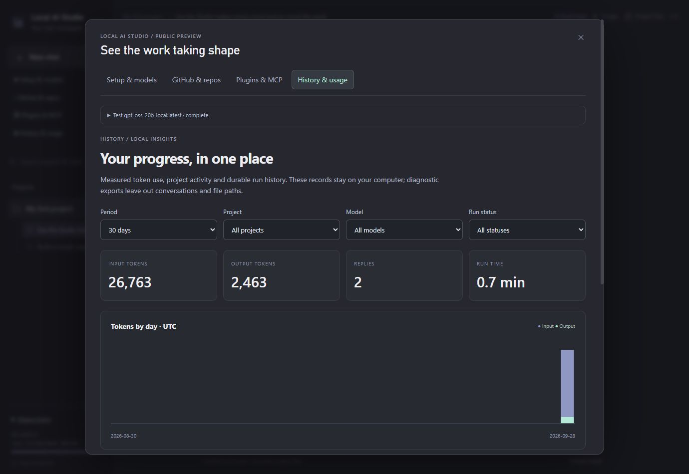

# Local AI Studio

A local workspace for people who want AI to **build real projects**, not just paste code into a chat. Choose an Ollama model, describe a website or app, and review connected files, checks, previews and version history in one place.

**Public preview · Windows installer · Node.js 22+ · MIT**



## Get started on Windows

1. Download the [latest release](https://github.com/kevindemara/local-ai-studio/releases) ZIP and extract it into a folder you want to keep. Source ZIP downloads also work.
2. Double-click **Setup.cmd**. A setup window explains what will be installed and offers a desktop shortcut.
3. The browser wizard checks CPU, GPU, RAM, storage and required tools. Install missing tools, start Ollama, then choose a model.
4. Add a project and use **Build** mode. Try: “Build a responsive plumber website with connected HTML, CSS and JavaScript. Verify it and start the preview.”

If Windows marks extracted scripts as downloaded, review the source and use the file’s Properties → Unblock, or the documented PowerShell `Unblock-File` command. Studio does not bypass system security settings. Keep the extracted folder: the shortcut launches the app from there.

No Docker, cloud account or paid model subscription is required. Internet is needed to install prerequisites, download models, use GitHub or connect remote tools. Installed local models and projects work offline.

## What you can do

- **Hardware-aware setup:** measured NVIDIA VRAM, CPU/RAM detection, Apple unified-memory handling, honest fallbacks for unknown adapters, model fit estimates and optional verified VRAM entry.
- **Choose free local models:** dated, sourced catalog; visible memory fit; streaming download progress and cancellation; automatic discovery of existing Ollama chat models; a short native-tool/speed test.
- **Build connected projects:** real file creation and edits, source search, starter templates, plans, command output, verification/repair loops, live previews and API checks.
- **Review and recover:** diffs, undo, checkpoints, chat forks, durable queued runs and interrupted-run recovery.
- **Use GitHub visually:** account connection through GitHub CLI, repository search/clone, project switching, Git initialization, selected-file commits, branch creation/switching, pull, push and repository publishing.
- **Customize changelogs:** preview a release entry using `{version}`, `{date}` and `{summary}`, then save it as a reviewed project change.
- **Add plugins and MCP:** import a server manifest, explicitly trust it, choose enabled projects, discover tools and call them from Build mode. Local stdio and Streamable HTTP are supported through the official MCP client SDK. A bundled read-only example is included.
- **See history and usage:** actual input/output token graphs, project overviews, filtered run history, expandable tool/terminal records and a diagnostic export that excludes chats and file paths.

Image generation is optional and requires a separately installed compatible local image engine. Model vision support does **not** mean image generation. See [configuration](docs/CONFIGURATION.md).

## Hardware and platforms

16GB VRAM is a useful target, not a requirement. Smaller CPU-only PCs receive smaller model suggestions; larger GPUs can use larger models. The current curated catalog includes Gemma 4 12B, Qwen 3.5 9B, GPT-OSS 20B, Qwen 3 1.7B and Qwen 3.8 27B. It was reviewed on **2026-09-28**. Recommendations describe memory suitability; they do not claim one model is universally best.

The wizard reserves memory for the runtime and context. A model’s download size is not its complete memory requirement. In particular, the 18GB Qwen 3.8 27B download does not fit fully in a 16GB GPU. CPU-assisted loading can work when sufficient RAM is available, with lower speed.

| Platform | Installation | Hardware detection |
| --- | --- | --- |
| Windows 11 | Setup.cmd installs Node if missing; browser wizard installs Ollama/Git/GitHub CLI through winget | CPU/RAM, NVIDIA measured VRAM, other adapter names with manual VRAM fallback |
| macOS | Install Node.js 22+ and Ollama, then `sh setup.sh`; Homebrew instructions included | CPU/RAM, Apple GPU/unified memory; discrete VRAM may be unknown |
| Linux | Install Node.js 22+ and Ollama using official packages, then `sh setup.sh` | CPU/RAM, NVIDIA measured VRAM, other adapter names when lspci is available |

Windows was exercised on a real 16GB NVIDIA system. macOS/Linux support is implemented and CI covers platform-independent workflows; GPU compatibility still depends on the [current Ollama hardware support matrix](https://docs.ollama.com/gpu), drivers and available memory. This release does not install GPU drivers or promise compatibility with every GPU. Non-Windows prerequisite installation is guided rather than automatic.

## Developer start

```sh
npm ci --ignore-scripts
npm start
```

Open **http://127.0.0.1:3211**. `npm run launch` starts the app in the background and opens a browser. `npm test` runs the regression and public-workflow checks without downloading model weights. Git must be installed for Git tests; template tests install small development dependencies.

Workspace data is stored separately from the source: `%LOCALAPPDATA%\LocalAIStudio` on Windows and `$XDG_DATA_HOME/LocalAIStudio` (or `~/.local/share/LocalAIStudio`) elsewhere. See [configuration and backups](docs/CONFIGURATION.md).

## Permissions and privacy

The server binds to loopback. API changes require a per-process token and matching origin. No telemetry or hosted analytics is included. Models, prompts, logs, generated files and credentials are not distributed with this repository.

Build mode can execute project code and install project dependencies **as your OS user** when development commands are enabled. It is not an operating-system sandbox. Plan/Ask modes restrict the assistant to built-in read tools and disable MCP actions. Trusted MCP programs have their own OS permissions; project assignment limits which chats may call them, not what those programs can access. Only enable servers you trust. Remote servers receive tool arguments.

GitHub login remains in GitHub CLI’s normal credential storage. Studio does not ask for a password or store a personal access token in its workspace. Public publishing sends committed history to GitHub; review selected files and commits first. Built-in source tools refuse common secret file types, but they cannot detect every secret embedded in source code.

## Research and next steps

The [current-tool comparison](docs/RESEARCH.md) compares Open WebUI, LM Studio, Jan and AnythingLLM and explains ideas still worth adding. The [roadmap](docs/ROADMAP.md) distinguishes shipped work from future features. Contributions are welcome; see [CONTRIBUTING.md](CONTRIBUTING.md) and [SECURITY.md](SECURITY.md).

Studio’s code uses the MIT license. Model weights, SDKs and prerequisites keep their respective licenses and terms. Model weights are downloaded directly from Ollama and are never bundled in a Studio release.
