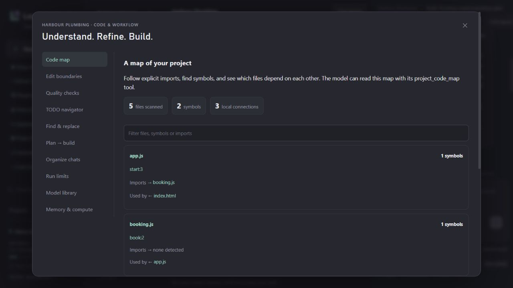

<h1>
<picture>
  <source media="(prefers-color-scheme: dark)" srcset="docs/brand/svg/local-ai-studio-logo-dark.svg">
  
</picture>
</h1>

A local workspace for people who want AI to **build real projects**, not just paste code into a chat. Choose an Ollama model, describe a website or app, and review connected files, checks, previews and version history in one place.

**0.6 preview · Windows installer · Node.js 22+ · MIT**



## Get started on Windows

1. Download the [latest release](https://github.com/kevindemara/local-ai-studio/releases) ZIP and extract it into a folder you want to keep. Source ZIP downloads also work.
2. Double-click **Setup.cmd**. A setup window explains what will be installed and offers a desktop shortcut.
3. The browser wizard checks CPU, GPU, RAM, storage and required tools. Install missing tools, start Ollama, then choose a model.
4. Add a project. The kickoff wizard asks for its goal, pages/features and visual style, then lets you edit the build plan. Create the starter and choose **Build this plan** when ready. Choose **Use an existing folder** to work on an existing project, then **Choose folder…** to browse local folders inside Studio and **Use this folder** to confirm. You can also paste an absolute folder path.

If Windows marks extracted scripts as downloaded, review the source and use the file’s Properties → Unblock, or the documented PowerShell `Unblock-File` command. Studio does not bypass system security settings. Keep the extracted folder: the shortcut launches the app from there.

No Docker, cloud account or paid model subscription is required. Internet is needed to install prerequisites, download models, use GitHub or connect remote tools. Installed local models and projects work offline.

## What you can do

- **Hardware-aware setup:** measured NVIDIA VRAM, CPU/RAM detection, Apple unified-memory handling, honest fallbacks for unknown adapters, model fit estimates and optional verified VRAM entry.
- **Choose free local models:** 11 dated, sourced choices with search and memory-fit/installed filters; streaming download progress and cancellation; automatic discovery of existing Ollama chat models; a short native-tool/speed test.
- **Build connected projects:** real file creation and edits, source search, starter templates, plans, live loading/reasoning/tool activity with elapsed time, command output, verification/repair loops, live previews and API checks.
- **Create local audio assets:** optional sound effects, original music and spoken voice. The Sound panel saves WAV clips into a project, plays them back and makes them available in Project files. Build mode can generate a clip when a project needs one.
- **Review and recover:** diffs, undo, checkpoints, chat forks, durable queued runs and interrupted-run recovery.
- **Use GitHub visually:** account connection through GitHub CLI, repository search/clone, project switching, Git initialization, selected-file commits, branch creation/switching, pull, push and repository publishing.
- **Customize changelogs:** preview a release entry using `{version}`, `{date}` and `{summary}`, then save it as a reviewed project change.
- **Connect common MCP servers:** browse 25 servers including Notion, Figma, Linear, Jira/Confluence, Sentry, Supabase, MongoDB, PostgreSQL, Neon, Hugging Face, web research, browser testing and documentation. Filter by category or connection type. Connect buttons show access and prerequisites, prepare pinned npm/Python servers or remote endpoints, discover tools and enable the selected project. Browser sign-in providers use a pinned OAuth bridge; account-key providers have environment setup guidance. Custom manifests, local stdio, Streamable HTTP and a bundled example are also supported.
- **See history and usage:** actual input/output token graphs, project overviews, filtered run history, expandable tool/terminal records and a diagnostic export that excludes chats and file paths.
- **Use Project hub:** a task board linked to real builds, local knowledge documents with reference excerpts, a context inspector with source exclusions, and reusable prompts with variables/slash commands.
- **Control model edits:** optional review-before-save proposals, original/proposed contents, per-file approval/rejection, stale-file protection and decision history.
- **Tune and compare models:** separate Ask/Plan/Build profiles, optional model routing, and serial two-model comparisons with actual responses and measured token speed.
- **Find and share work:** full conversation-content search, a Ctrl/Cmd K command palette for files/projects/tools/prompts, and checksum-verified source-only project ZIP export/import.
- **Understand and refine code:** a searchable symbol/import map with reverse dependencies, source-line navigation, TODO-to-task cards and reviewed multi-file literal replacements.
- **Control each build:** allowed/protected edit paths, ordered lint/typecheck/build/test scripts, reviewed Plan-to-Build handoff, and wall-clock/model-round limits that preserve completed work.
- **Manage a growing local workspace:** pin/tag/archive chats, inspect installed model storage/capabilities, deliberately remove exact model tags, and choose Eco/Balanced/Warm memory or Auto/CPU compute.

See the [Project hub guide](docs/PROJECT-HUB.md) for workflows and limits, and the [20-feature research and selection](docs/FEATURE-RESEARCH.md) for what shipped and what remains a candidate.

The new [Code & workflow guide](docs/CODE-WORKFLOW.md) covers the ten additions in 0.5. Read [another twenty researched features](docs/FEATURE-RESEARCH-02.md) for the ranked selection and ten future candidates. Open **Code & workflow** in the sidebar; model storage and memory controls also appear under **Setup & models**.

Image and audio generation are optional and require separately installed local engines. Model vision support does **not** mean image generation. See [configuration](docs/CONFIGURATION.md).

### Optional local sound models (Windows NVIDIA)

On a CUDA-capable NVIDIA PC with around 16 GB VRAM, install [ACE-Step 1.5](https://github.com/ace-step/ACE-Step-1.5) for music, [MOSS SoundEffect v2](https://github.com/OpenMOSS/MOSS-TTS/tree/main/moss_soundeffect_v2) for effects, and [Qwen3-TTS VoiceDesign](https://github.com/QwenLM/Qwen3-TTS) for speech. The model files total roughly 24 GB; allow more space for three isolated Python environments and downloads. Install official Python 3.12, Git and [uv](https://docs.astral.sh/uv/getting-started/installation/) first, then run `powershell -ExecutionPolicy Bypass -File scripts/install-audio.ps1` from the Studio folder and restart Studio. The script downloads model weights directly from their publishers, keeps them outside Git, and does not alter Windows security settings. On systems where Smart App Control blocks an unsigned Python runtime, use the signed python.org installer.

Open **Sound** in a project to generate a short effect, an instrumental or lyrical track, or a spoken line. Music defaults to the standard ACE-Step turbo model with its 1.7B planner; the XL model needs more headroom. Only one audio job runs at a time, and Studio unloads Ollama chat models before it starts. MOSS effect generation uses a practical 24-step default. Longer clips take more time and memory. Model weights retain their own [MIT](https://huggingface.co/ACE-Step/Ace-Step1.5), [Apache 2.0](https://huggingface.co/OpenMOSS-Team/MOSS-SoundEffect-v2.0), and [Apache 2.0](https://huggingface.co/Qwen/Qwen3-TTS-12Hz-1.7B-VoiceDesign) licenses respectively. The optional audio installer currently targets Windows with an NVIDIA CUDA GPU; other Studio platforms still run without audio.

## Hardware and platforms

16GB VRAM is a useful target, not a requirement. Smaller CPU-only PCs receive smaller model suggestions; larger GPUs can use larger models. The 11-model catalog includes Gemma 4 12B/E2B/E4B, Qwen 3.5 9B/4B/2B/0.8B, GPT-OSS 20B, Qwen 3 1.7B, Qwen 3.8 27B and Ministral 3 8B. It was reviewed on **2026-09-28**. Recommendations describe memory suitability; they do not claim one model is universally best.

The wizard reserves memory for the runtime and context. A model’s download size is not its complete memory requirement. In particular, the 18GB Qwen 3.8 27B download does not fit fully in a 16GB GPU. CPU-assisted loading can work when sufficient RAM is available, with lower speed.

| Platform | Installation | Hardware detection |
| --- | --- | --- |
| Windows 11 | Setup.cmd installs Node if missing; browser wizard installs Ollama/Git/GitHub CLI through winget | CPU/RAM, NVIDIA measured VRAM, other adapter names with manual VRAM fallback |
| macOS | Install Node.js 22+ and Ollama, then `sh setup.sh`; Homebrew instructions included | CPU/RAM, Apple GPU/unified memory; discrete VRAM may be unknown |
| Linux | Install Node.js 22+ and Ollama using official packages, then `sh setup.sh` | CPU/RAM, NVIDIA measured VRAM, other adapter names when lspci is available |

Windows was exercised on a real 16GB NVIDIA system. macOS/Linux support is implemented and CI covers platform-independent workflows; GPU compatibility still depends on the [current Ollama hardware support matrix](https://docs.ollama.com/gpu), drivers and available memory. This release does not install GPU drivers or promise compatibility with every GPU. Non-Windows prerequisite installation is guided rather than automatic.

## Working in the 0.3 workspace

- **Build workspace:** keep projects, a file tree, inline editor, live preview and chat together. Drag the tree/chat dividers or use their arrow keys; widths are remembered. Switch back to Chat layout anytime. On phones, the editor and file tree stack below chat.
- **Editor:** click a source file, edit it, and Save or press Ctrl/Cmd S. Optional autosave waits until the model is idle. Saves retain the previous file version and refuse to overwrite a file changed since it was opened. Unsaved drafts are kept for the browser session; switching projects asks whether to save or discard them.
- **Preview and output:** start the actual local preview, enable Split to keep it beside the editor, or select Output to see task output and run project checks. Static websites work immediately; app starters may need their dependencies installed first.
- **Build progress:** Prepare, Create files, Check and Preview reflect recorded work. Passing checks and a ready preview are shown only after tool results confirm them. View activity opens the run log; completed setup actions live in a collapsed Recent activity drawer.
- **Recovery:** failed builds offer relevant actions such as starting Ollama, unloading models, choosing a smaller installed model or using 4K reply context. Continue saved work inspects existing files in bounded sections before resuming; long reads retain their last excerpt and next line number across context checkpoints. A CUDA initialization error may still need an Ollama/driver update; a recovery button cannot guarantee a driver fix.

## Updates and backups

Open **Updates & backups** in the sidebar. Studio checks the official GitHub releases at startup and every six hours; automatic checks can be disabled. Choose Preview or Stable releases. Updates are never installed automatically while you are working.

For extracted release installs, **Install update when idle** backs up the workspace, downloads the release, verifies its SHA-256 digest against GitHub metadata and installs dependencies into a separate version folder. **Restart into prepared version** activates it, and the existing desktop launcher follows the selected version. If the new server fails its startup health check, the previous app is relaunched. The old installation remains available. These source archives are checksum-verified, **not publisher-signed desktop packages**.

Developer Git checkouts use **Prepare release** and remain under Git control: update source with Git or launch the prepared release separately. Studio does not replace your checkout or local changes.

**Create workspace backup** saves project source files, chats, settings and file history locally. Recovery verifies file checksums and opens recovered projects in separate folders, leaving original project folders intact. It creates a backup before recovery and disables MCP access until you reconnect. Dependency folders, Git history, model weights and OAuth/GitHub credential stores are excluded. Backups can contain private project files and are not encrypted. Details and limits are in [configuration](docs/CONFIGURATION.md#workspace-recovery).

## Developer start

```sh
npm ci --ignore-scripts
npm start
```

Open **http://127.0.0.1:3211**. `npm run launch` starts the app in the background and opens a browser. `npm test` runs the regression and public-workflow checks without downloading model weights. Git must be installed for Git tests; template tests install small development dependencies.

Workspace data is stored separately from the source: `%LOCALAPPDATA%\LocalAIStudio` on Windows and `$XDG_DATA_HOME/LocalAIStudio` (or `~/.local/share/LocalAIStudio`) elsewhere. See [configuration and backups](docs/CONFIGURATION.md).

## Permissions and privacy

The server binds to loopback. API changes require a per-process token and matching origin. No telemetry or hosted analytics is included. Models, prompts, logs, generated files and credentials are not distributed with this repository.

Build mode can execute project code and install project dependencies **as your OS user** when development commands are enabled. It is not an operating-system sandbox. Plan/Ask modes restrict the assistant to built-in read tools and disable MCP actions. Trusted MCP programs have their own OS permissions; project assignment limits which chats may call them, not what those programs can access. Only enable servers you trust. Remote servers receive tool arguments.

GitHub login remains in GitHub CLI’s normal credential storage. Studio does not ask for a password or store a personal access token in its workspace. Public publishing sends committed history to GitHub; review selected files and commits first. Built-in source tools refuse common secret file types, but they cannot detect every secret embedded in source code.

## Research and next steps

The [current-tool comparison](docs/RESEARCH.md) compares Open WebUI, LM Studio, Jan and AnythingLLM and explains ideas still worth adding. The [roadmap](docs/ROADMAP.md) distinguishes shipped work from future features. Contributions are welcome; see [CONTRIBUTING.md](CONTRIBUTING.md) and [SECURITY.md](SECURITY.md).

Studio’s code uses the MIT license. Model weights, SDKs and prerequisites keep their respective licenses and terms. Model weights are downloaded directly from Ollama and are never bundled in a Studio release.
