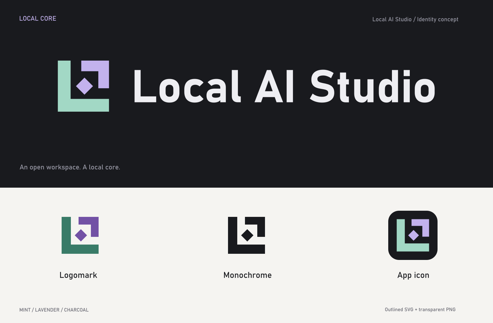

# Local AI Studio — Local Core

A geometric L anchors an open square workspace. A small diamond represents the
local intelligence at its center. The full logo pairs that mark with an outlined
Bahnschrift Bold wordmark, matching the application's existing display type.

## Files

- `svg/local-ai-studio-logo-dark.svg`: horizontal logo for dark backgrounds.
- `svg/local-ai-studio-logo-light.svg`: horizontal logo for light backgrounds.
- `svg/local-ai-studio-logo-mono.svg` and `svg/local-ai-studio-logo-white.svg`: single-color logos.
- `svg/local-ai-studio-mark.svg`: standalone color mark for dark backgrounds.
- `svg/local-ai-studio-mark-light.svg`: standalone color mark for light backgrounds.
- `svg/local-ai-studio-mark-mono.svg` and `svg/local-ai-studio-mark-white.svg`: single-color marks.
- `svg/local-ai-studio-app-icon.svg`: mark on a charcoal rounded-square tile.
- `svg/local-ai-studio-favicon.svg`: slightly larger mark for small browser icons.
- `png/`: transparent PNG logo and mark exports, 512/256px app icons, 32/16px favicons.
- `concept-board.png`: the original generated concept, before vector refinement.
- `brand-preview.png`: the final production geometry and outlined wordmark.

All production SVGs use filled paths, with no external fonts, scripts, images,
filters, or network dependencies. PNG logo and mark backgrounds are transparent;
app icons include the charcoal tile. The application uses this logo in the sidebar, the mark on the welcome screen,
and the icons in the browser, Windows setup window, and desktop shortcuts.

## Color and spacing

| Role | On dark backgrounds | On light backgrounds |
| --- | --- | --- |
| Local L | Mint `#A2D8C5` | Deep mint `#397B68` |
| Frame and core | Lavender `#C3B2ED` | Deep lavender `#7251A5` |
| Wordmark | Near-white `#EEEEF2` | Charcoal `#191A1E` |

The light-background colors are darker so the mark stays clear on white.
Use the supplied monochrome variant when only one ink/color is available.
Keep a clear space of at least one L stroke around the mark and logo. This is
12 units on the mark's 64-unit grid. Use the mark for small placements; the full
horizontal logo is intended for widths of approximately 200px and above.
Use the favicon export at 16–32px, and the app icon for shortcuts or app tiles.
Scale proportionally and retain the spacing between the mark and wordmark.

## Rebuilding

`source/build-brand.ps1` creates the vector assets on Windows with Bahnschrift
installed. Text is converted to paths with System.Drawing. Run it in PowerShell.
`source/render-brand.cjs` creates the PNG exports with Node.js and Sharp. Pass a
Sharp package path as its first argument when Sharp is not on Node's module path.
The original concept used the built-in image generation tool; the complete prompt
is preserved in `source/concept-prompt.txt`.
